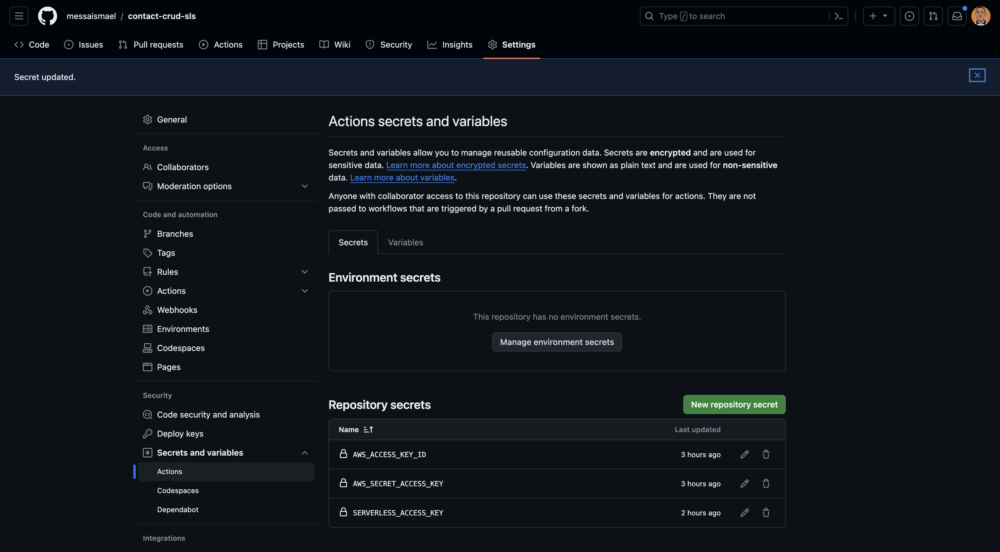
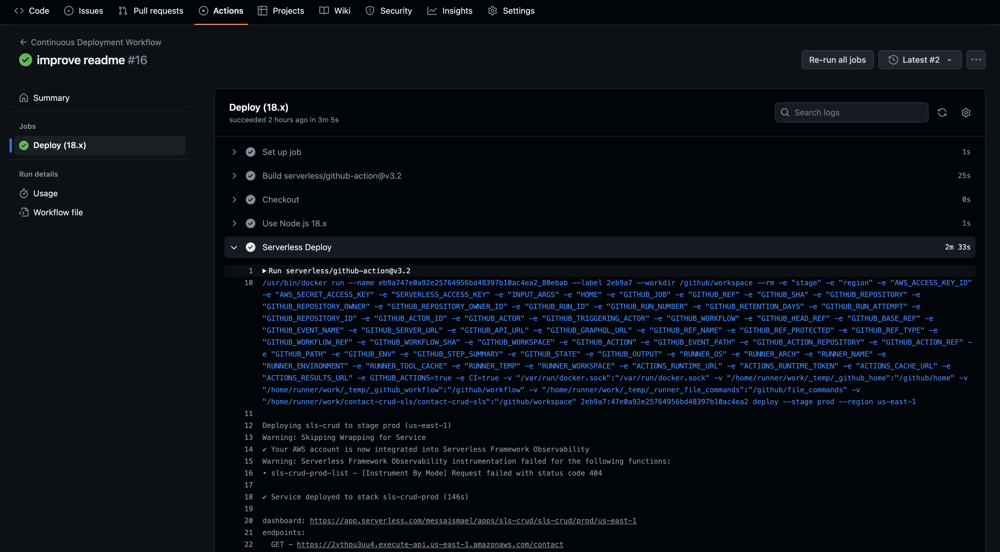

# Contacts CRUD REST API

This project is built using [Serverless Framework](https://github.com/serverless) with Nodejs. It includes 5 functions, each executing a specific business process (Create, Update, Delete, List and Retrieve), and each triggered by an API Gateway.

### Tools

- Serverless Framework
- Nodejs
- DynamoDb
- API Gateway
- Aws-sdk


### Continuous Deployment

For deployment we used **Github Actions** to automate the deployment process of our Backend Serverless. To set up well the Github Actions, You have to provide the right **AWS user credentials** and the **Serverless access key** into the GitHub Actions from `Your repository > Settings > Secrets and variables > Actions`, as illustrated below:

**Note:** Use the **Principle of Least Privilege** when you create the AWS user to keep your AWS account secure.




To get **SERVERLESS_ACCESS_KEY**, you should follow [this](https://www.serverless.com/framework/docs/guides/cicd/running-in-your-own-cicd).

The CD pipeline supports multi-stage deployment based on the branch names below: 
  - main:  `prod`
  - develop: `dev` 

After deploying, you should see output after the `Serverless Deploy` step in the workflow similar to:



```bash
Deploying sls-crud to stage dev (us-east-1)

✔ Service deployed to stack sls-crud-dev (152s)

endpoint: GET - https://xxxxxxxxxx.execute-api.us-east-1.amazonaws.com/
```

### Author

[Ismael Messa](https://messaismael.com)